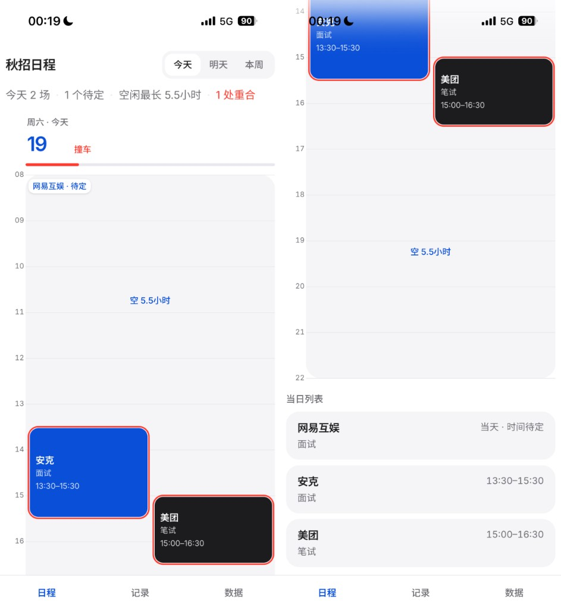
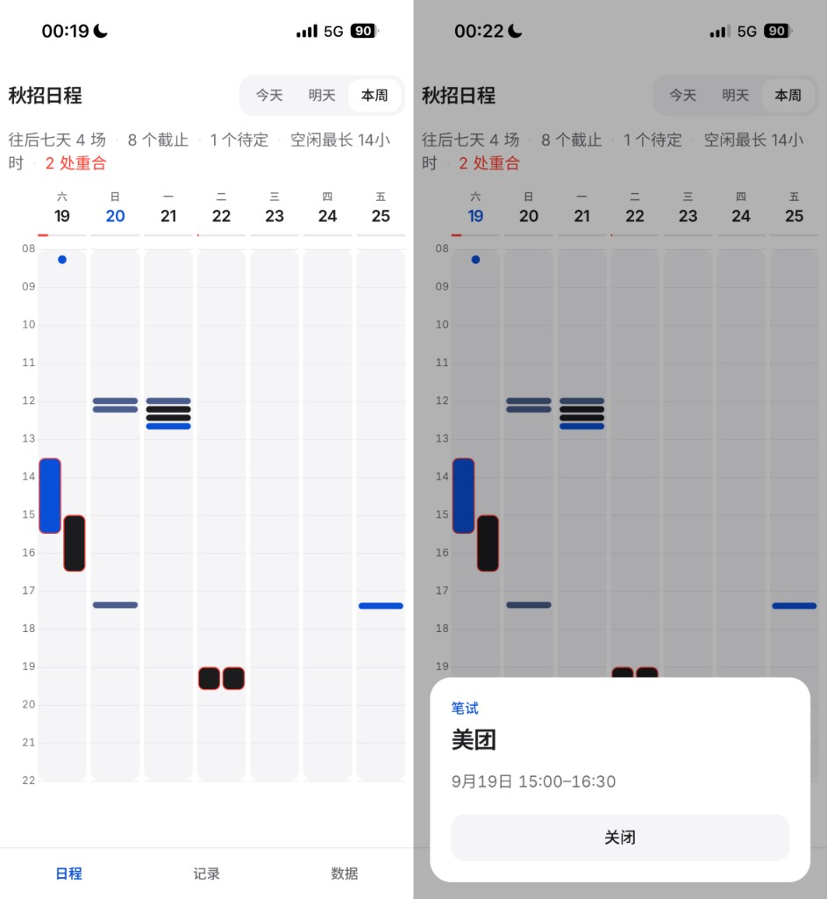
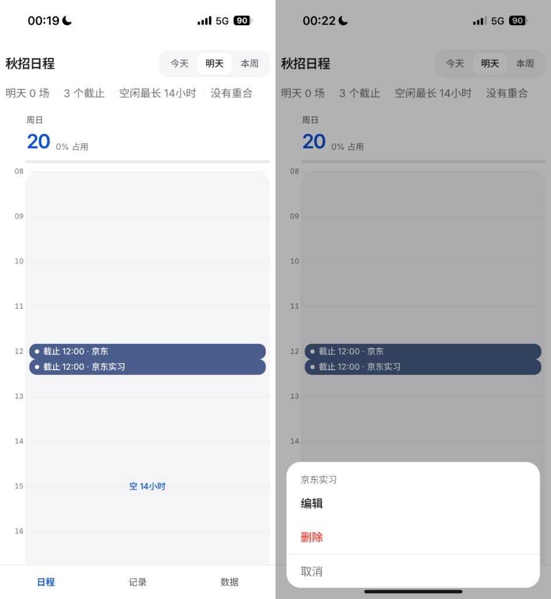
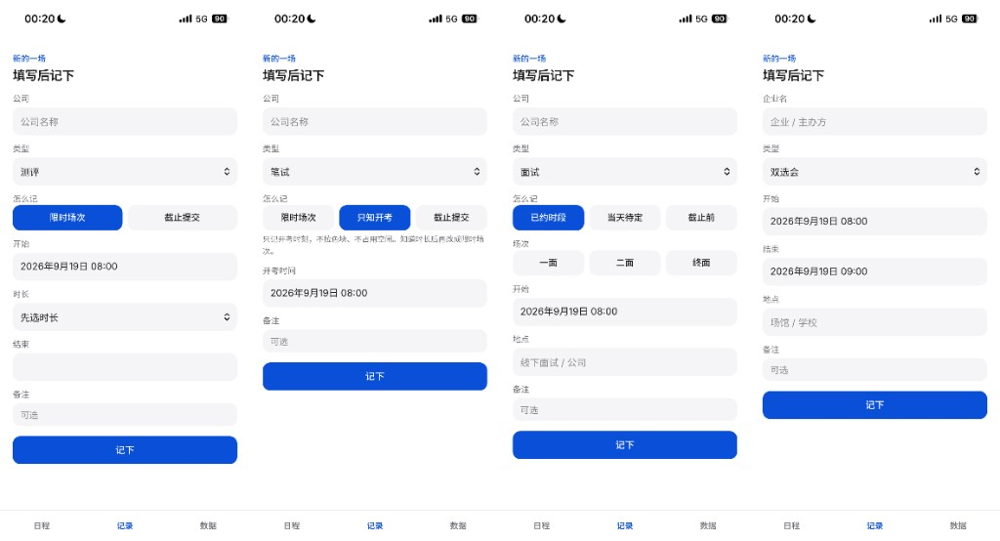
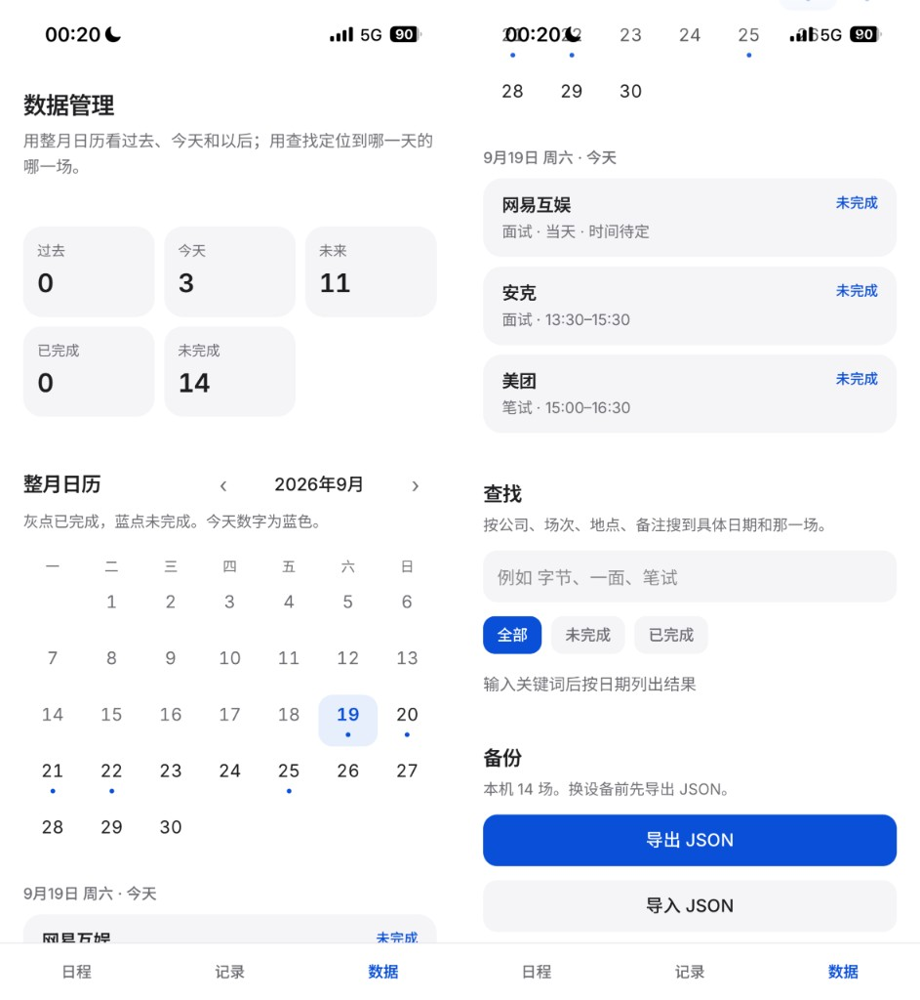

# 秋招日程

打开即用：https://dewyue.github.io/qiuzhao-schedule/

市面日历把**事件**当主角，空白只是底。秋招把信息砸过来时，真正要回答的是：这段还能不能排、会不会撞车。所以这里把 **占用 vs 空闲** 当主角——空闲是可点的一等对象，色块只是占用的结果。

仓库：https://github.com/Dewyue/qiuzhao-schedule

---

## 产品在解决什么

| 痛点 | 普通日历 | 本应用 |
|------|----------|--------|
| 中间空多久 | 肉眼估 | 空闲标签直接写出「空 1小时20分」，可点 |
| 多场重叠 | 叠在一起难辨 | 并排分道，冲突描红 |
| 只有 DDL / 待定 / 只知开考 | 硬记成整段会议 | 按形态分别占格、打钉或挂当天 |
| 隐私与换机 | 常要登录云同步 | 数据只在本机；JSON 导出/导入 |

**非目标（刻意不做）：** 账号与云同步、企业端、自动爬官网排期、多人协作或甘特。

---

## 和普通日历不一样（核心原则）

1. **空闲是对象，不是「没画东西」**  
   时间柱浅底是可滚动、可点击的轨道。够长的空闲会标「空 ×」，点它进入记录并预填开始时间。

2. **一天一条时间柱**  
   默认窗口 **06:00–24:00**。实心色块 = 占用；浅轨 = 空着。顶底小时线不画穿圆角，灰柱 `overflow` 裁进圆角内。

3. **今天 / 明天 / 本周同一套柱**  
   - **今天 / 明天**：宽色块 + 当日列表。  
   - **本周**：从**当天**起往后七天（不是周一到周日），窄色块，点开浮窗看详情。  
   顶部摘要会汇总场数、截止/开考/待定数量、最长空闲、是否有重合。

4. **秋招字段，不是通用「会议」**  
   测评、笔试、面试（一面 / 二面 / 终面）、双选会。每种类型可选的「怎么记」不同（见下）。

5. **数据只在本机**  
   `localStorage` + IndexedDB 双写；Service Worker 方便加到主屏幕后仍能打开。不登录、不上传。换设备用 JSON。

---

## 界面总览

占用和空闲在同一根时间柱上。待定挂在当天顶部；撞车并排标出。点色块看详情（浮窗里编辑 / 删除）；**长按色块上下拖**改整段占用时间。



本周从今天起往后七天，窄色块点开浮窗。



只有截止、不拉色块时，在轴上打钉（不吃空闲）。



记录按类型裁剪字段。



数据页：整月日历、关键词查找、JSON 备份。



---

## 功能说明（尽量写全）

### 1. 日程视图：时间柱

| 项目 | 行为 |
|------|------|
| 时间窗 | 默认 06:00–24:00；若有场次超出，窗口会按内容略扩，仍夹在 0–24 |
| 占用色块 | 测评 / 笔试 / 面试 / 双选会用不同底色；密时只显示公司，够高时显示类型与时段 |
| 空闲标签 | 足够长的空隙显示「空 ×」；点它 → 打开记录并预填该空隙起点 |
| 点空白灰底 | 按点击位置吸附到约 15 分钟刻度，打开记录并预填 |
| 撞车 | 时间重叠的占用并排分道，色块描危险色；日头可显示「撞车」与占用百分比 |
| 现在线 | 今天视图在当前时刻画一条红线 |
| 当日列表 | 今天 / 明天模式下，柱下方列出当天场次；点开同样进详情浮窗 |
| 滑动 | 色块长按会吃掉纵向手势；**在页面底部白色留白、灰柱两侧空白、空闲标签上**上下滑可滚页面 |

### 2. 交互：点按与长按拖动（动态效果）

这是近期补上的核心手势，建议在手机上体验。

**点一下色块 / 列表行**

- 打开详情浮窗：公司、类型、占用时段、截止属性（若有）、地点、备注。  
- 浮窗底部：**编辑**（跳到记录页）、**删除**、**关闭**。  
- 不再用「长按弹出编辑菜单」——长按改成拖时间。

**长按色块上下拖**

| 步骤 | 表现 |
|------|------|
| 按住约 0.2s | 进入拖动；可选轻微震动；整页滚动暂时锁住，避免整页跟着跳 |
| 拖动中 | 色块**像素级跟手**（不再 15 分钟一跳）；时长不变，整段平移；预览时间文案跟着变 |
| 松手 | 落到**最近的一分钟**；写入本机存储；截止提交类：`deadline` 属性保留，只改占用的 start/end |
| 钉状标记 | 开考钉、纯截止钉也可上下拖，改其时刻 |

拖动时色块用 `translate3d` 直跟指针，并去掉按钮上的 transform 过渡，避免「一顿一顿」；手势期间 `touchmove` / `wheel` 会被拦住，松手后恢复滚动。

### 3. 记录类型与「怎么记」

底部导航 **记录** 打开表单。类型决定可选模式与字段。

#### 测评

| 模式 | 含义 | 是否占格 |
|------|------|----------|
| 限时场次 | 有明确开始 + 结束（或时长推出结束） | 占 |
| 截止提交 | 有**截止时间**属性 + 默认时长（默认 30 分） | 占 |

**截止提交逻辑：**

1. 填截止 → 开始 = 截止 − 默认时长，结束先等于截止。  
2. 改开始 → **时长不变**，结束 = 开始 + 时长；截止字段不动。  
3. 改默认时长（在已有截止时）→ 再从截止倒推开始，结束对齐截止。  
4. 日程上按开始→结束画色块；详情里另起一行写「截止 …」。

#### 笔试

| 模式 | 含义 | 是否占格 |
|------|------|----------|
| 限时场次 | 明确时段 | 占 |
| 只知开考 | 只记开考时刻 | 不占，轴上打「开考」钉 |
| 截止提交 | 同测评截止逻辑 | 占 |

#### 面试

| 模式 | 含义 | 是否占格 |
|------|------|----------|
| 已约时段 | 开始 + 时长/结束；场次可选一面/二面/终面；可填地点 | 占；默认时长常按 1 小时起 |
| 当天待定 | 只挂日期 | 不占柱身，挂在当天顶部「待定」 |
| 截止前 | 与测评/笔试「截止提交」同理（截止属性 + 默认时长倒推占用） | 占 |

#### 双选会

企业名、开始、结束、地点；按时段占格。

### 4. 详情与编辑

- 从日程色块、当日列表、数据页月历/搜索进入同一套详情。  
- **编辑**进入记录页并带入草稿；保存后回日程。  
- **删除**立即从本机列表移除。

### 5. 数据页

| 区块 | 能力 |
|------|------|
| 统计条 | 过去 / 今天 / 未来场数，已完成 / 未完成（按时间状态） |
| 整月日历 | 灰点已完成、蓝点未完成；今天数字高亮；点某日看该日列表 |
| 查找 | 公司、场次、地点、备注、类型关键词；可筛全部 / 未完成 / 已完成；结果按日期分组 |
| 备份 | **导出 JSON**（含 `app`、`exportedAt`、`events`）；**导入 JSON**整表替换本机数据 |

导入会规范化类型、`kind`、以及旧数据里的截止字段（无 `deadline` 时按起止跨度推断）。

### 6. 数据与离线

- 写入路径：内存状态 → `localStorage` + IndexedDB。  
- 启动：优先已有 localStorage；否则回填 IndexedDB（减轻 iOS 主屏幕 Web App 被清存储的风险）。  
- 可请求 `navigator.storage.persist()`。  
- Service Worker 注册后，GitHub Pages 静态资源可缓存，便于「加到主屏幕」再打开。

### 7. 底部导航

| Tab | 作用 |
|-----|------|
| 日程 | 时间柱 + 范围切换 +（今明）当日列表 |
| 记录 | 新建 / 编辑表单 |
| 数据 | 月历、搜索、导入导出 |

---

## 设计语言（摘要）

- 气质：接近 Apple 产品页 / 个人站——白底与 `#f5f5f7` 浅轨，不是草稿纸课表。  
- 字体：Inter + Noto Sans SC。  
- 强调色 `#0a4fd8`；冲突用 `#ff3b30`。  
- 大圆角色块；颜色 / 透明度过渡约 250ms；色块拖动时关闭 transform 过渡以免发粘。  
- 原则：**空闲是一等公民，事件不拥有整列。**

更细的视觉约束见仓库内 `DESIGN.md`。产品需求长文可后续以 PRD 单独维护（`docs/` 下）。

---

## 技术栈与结构

- Vite + React 19 + TypeScript + Tailwind CSS v4  
- 主要逻辑：`src/lib/time.ts`（占用、空闲、撞车分道、截止时刻、拖动平移）  
- 手势：`src/lib/drag.ts`  
- 持久化：`src/lib/storage.ts`、`src/lib/idb.ts`、`src/state/EventsContext.tsx`  
- 界面：`DayColumn` / `OccupancyBoard` / `EventForm` / `EventDialogs` / `DataPanel` 等  

---

## 本地开发

```bash
npm install
npm run dev
```

```bash
npm run build   # tsc + vite build
npm run preview
```

推到 `main` 会走 GitHub Actions，发布到 GitHub Pages（`base` 在 CI 下为 `/qiuzhao-schedule/`）。

---

## 使用建议（手机）

1. Safari / Chrome 打开 Pages 链接 → 分享 → **添加到主屏幕**，少占浏览器标签。  
2. 换手机前先到 **数据 → 导出 JSON**。  
3. 改时间：长按色块拖；改文案/类型：点开 → 编辑。  
4. 页面滚不动时，在**底部白边**或灰柱两侧空白处滑，不要按在色块上滑。
